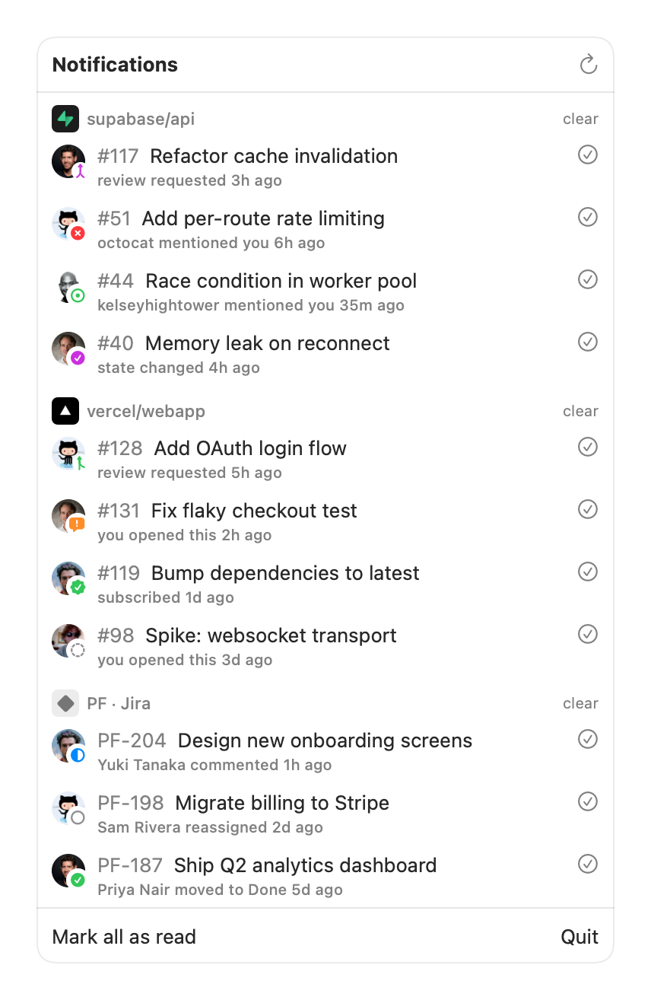

<p align="center">
  
</p>

<h1 align="center">Magpie</h1>

<p align="center">A macOS menu-bar notification aggregator.</p>

Pulls items from multiple sources into one popover, grouped by source, with
type/state icons, author avatars, and per-row dismiss. Built on SwiftUI
`MenuBarExtra` (`.window` style), so the popover stays open and updates in
place.

<p align="center">
  
</p>

Sources are adapters. Two ship today:

- **GitHub** — unread notifications via the `gh` CLI (reuses existing auth; no
  token handling, no third-party OAuth app). Each PR/issue is enriched with its
  live state (open / merged / closed / draft / changes-requested / approved).
- **Jira** — assigned + watched + reported issues via `jira-cli`, enriched with
  status category and assignee avatar. "Seen" is local (Jira has no per-issue
  read state): dismissing hides an issue until it next changes.

## How it compares

Magpie is the only tool here that combines GitHub notifications and Jira issues
in a native macOS menu bar while reusing your existing `gh` and `jira-cli`
logins, so there's no OAuth app to authorize and no token to paste in.

| Tool | Sources | Platform | Auth | License | Price |
|------|---------|----------|------|---------|-------|
| **Magpie** | GitHub + Jira | macOS | Reuses `gh` / `jira-cli` | Open source (MIT) | Free |
| [Gitify](https://gitify.io) | GitHub (+ Enterprise, Gitea) | macOS / Windows / Linux | OAuth / PAT | Open source (MIT) | Free |
| [JiraBar](https://github.com/menubar-apps/JiraBar) | Jira | macOS | Host + API token | Open source | Free |
| [Octobox](https://octobox.io) | GitHub | Web (self-host) | GitHub OAuth | Open source (AGPL-3.0) | Free public repos; $10/user/mo private |
| [CatLight](https://catlight.io) | Jira + GitHub (PRs/Actions) + CI | macOS / Windows / Linux | Per-service login | Proprietary | Free tier + paid |
| [MergeHelper](https://mergehelper.com) | GitHub + GitLab (PRs/MRs) | macOS | PAT (Keychain) | Proprietary | $12 |

CatLight is the only other multi-source option, and it's CI/CD-centric rather
than a notification-triage tool. Everything else covers a single slice: Gitify
and Octobox are GitHub-only, MergeHelper tracks PRs and MRs across GitHub and
GitLab but not Jira, and JiraBar is Jira-only. Pricing is current as of June
2026.

## Requirements

- macOS 13+
- [`gh`](https://cli.github.com) authenticated (`gh auth status`)
- [`jira-cli`](https://github.com/ankitpokhrel/jira-cli) initialized, if using
  the Jira adapter. Its API token is read from the macOS Keychain and injected
  into the `jira` subprocess (see config).

## Configure

Copy `config.example.json` to `~/.config/magpie/config.json` and fill it in.
`ghPath`/`jiraPath` are optional (the app probes the usual install dirs). Omit
the whole `jira` block to run GitHub-only.

For Jira, store the API token in the Keychain under the service name in your
config (default `magpie-jira`):

```
security add-generic-password -a "you@example.com" -s magpie-jira -w 'YOUR_JIRA_API_TOKEN' -U
```

## Install with Homebrew

```
brew install --cask fmguerreiro/tap/magpie
```

Magpie is ad-hoc signed, not notarized, so Gatekeeper quarantines it on first
launch. Clear it once:

```
xattr -dr com.apple.quarantine "/Applications/Magpie.app"
```

(or right-click the app in Finder, choose **Open**, then **Open** again).

## Build and install

```
make install      # build Magpie.app and install it to ~/Applications
```

Other targets:

```
make app          # assemble dist/Magpie.app (build + bundle + icon + ad-hoc sign)
make dmg          # package dist/Magpie.dmg for handing to another machine
make icon         # regenerate AppIcon.icns from scripts/make-icon.swift
make build        # compile the release binary only
make clean
```

## Regenerating the screenshot

The screenshot above is rendered from canned demo data (no real accounts
touched). `MAGPIE_DEMO=1` swaps in a fixed set of items covering every state;
`MAGPIE_SHOT=<path>` renders the popover to a PNG and exits.

```
make build
MAGPIE_DEMO=1 MAGPIE_SHOT="$PWD/docs/screenshot.png" .build/release/Magpie
```

Run `MAGPIE_DEMO=1 .build/release/Magpie` without `MAGPIE_SHOT` to drive the
live menu-bar popover with the same demo data.

## Installing on another Mac

`make dmg` produces `dist/Magpie.dmg`; open it and drag Magpie to Applications.

The app is **ad-hoc signed**, not notarized, so a Mac that didn't build it will
quarantine it on first launch ("Magpie can't be opened because Apple cannot
check it for malicious software"). Clear it one of two ways:

- Right-click the app in Finder, choose **Open**, then **Open** again; or
- `xattr -dr com.apple.quarantine /Applications/Magpie.app`

For friction-free distribution you'd sign with an Apple **Developer ID**
certificate and notarize (`xcrun notarytool submit` + `xcrun stapler staple`),
which needs a paid Apple Developer account. The build script's `codesign -s -`
line is where a real signing identity would slot in.

Each machine also needs the runtime prerequisites above (`gh` authenticated,
`jira-cli` initialized + Keychain token) and its own `~/.config/magpie/config.json`.

## License

MIT. See [LICENSE](LICENSE).
